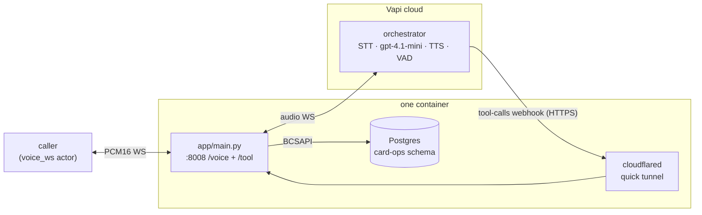

# riley-vapi

Riley, a card-support voice agent for Acme Bank, built on [Vapi](https://docs.vapi.ai/) — a **hosted voice orchestrator running Deepgram STT, an OpenAI `gpt-4.1-mini` chat LLM, and ElevenLabs TTS**. Vapi's cloud runtime owns the conversation loop (VAD, endpointing, interruption detection, turn-taking); this repo runs the thin half that must live in your infrastructure: a `voice_ws` audio bridge into a Vapi WebSocket call, and the `/tool` webhook that executes Riley's five Postgres-backed card-ops tools. (For the full "what runs where" breakdown of Vapi's split-runtime architecture, see [`docs/vapi-architecture.md`](docs/vapi-architecture.md).)

## What it does

One FastAPI process (`app/main.py`) on `:8008`:

1. **`WS /voice`** — the `voice_ws` endpoint the Veris actor calls. Each connection POSTs `api.vapi.ai/call` to create a WebSocket-transport call with an inline assistant (system prompt from `agent_desc.txt`, the five tools, PCM16 @ 24 kHz), then pumps binary audio both ways between the actor and the Vapi call WebSocket.
2. **`POST /tool`** — the webhook Vapi's orchestrator calls when the LLM picks a tool. Dispatches against `BCSAPI` (Postgres) and returns the result synchronously; each call is also reported to the Veris engine so it lands in the graded trace.
3. **cloudflared quick tunnel** — Vapi cloud must reach `/tool` over public HTTPS, so on the first `/voice` connection the app spawns `cloudflared` and uses the unique `trycloudflare.com` URL it gets (set `PUBLIC_BASE_URL` to skip this). Unique-per-invocation URLs mean concurrent sims never share an endpoint.



## Why a tunnel

Vapi executes custom function tools by POSTing to a `server.url` you host — the traffic direction is Vapi → you. A sandbox pod has outbound internet but is not publicly addressable, so the app exposes `/tool` through a cloudflared quick tunnel it spawns itself. Quick tunnels (unlike free-tier ngrok, which pins one static domain per account) get a unique random URL per invocation, so parallel sims never collide.

## End-of-turn silence

The `voice_ws` actor's VAD needs ~1.5 s of silence to commit end-of-speech, but a WebSocket carries no ambient silence between turns. When Vapi signals the assistant finished speaking (`speech-update`, `status=stopped`), the bridge pumps ~1700 ms of PCM silence so the actor's VAD reliably fires.

## Run a Veris simulation against it

Everything the simulator needs is in `.veris/`: a `voice_ws` actor channel pointed at the bridge (`ws://localhost:8008/voice`) and `Dockerfile.sandbox`. You need the `veris` CLI and an account — run `veris login` first. `curl` and `jq` are used for the two API calls below.

Export your profile's values from `~/.veris/config.yaml` (written by `veris login`, under your active profile `profiles.<name>`):

```bash
export VERIS_URL=...    # backend_url
export VERIS_KEY=...    # api_key
export VERIS_ORG=...    # organization_id
```

**1. Create an environment.** This repo already ships a complete `.veris/`, so create a bare environment and drive everything by its id:

```bash
ENV_ID=$(curl -sS -X POST "$VERIS_URL/v1/environments" \
  -H "Authorization: Bearer $VERIS_KEY" -H "Content-Type: application/json" \
  -d "{\"name\":\"riley-vapi\",\"organization_id\":\"$VERIS_ORG\",\"skip_managed_onboarding\":true}" \
  | jq -r '.environment.id')
echo "$ENV_ID"
```

**2. Set the provider key** (secret, one-time — Vapi runs STT/LLM/TTS under its own provider accounts, so this is the only key needed):

```bash
veris env vars set VAPI_API_KEY=... --secret --env-id "$ENV_ID"
```

**3. Build & push the image:**

```bash
veris env push --env-id "$ENV_ID"
```

This builds `.veris/Dockerfile.sandbox` — installs `cloudflared`, runs `uv sync --frozen` (needs the committed `uv.lock`), and copies `app/`, `agent_desc.txt`, `db/init.sql`, and `start.sh`.

**4. Generate a scenario set** (also creates the grader bound to the set):

```bash
veris scenarios create --num 5 --env-id "$ENV_ID"   # prints a scenset_… id
veris scenarios status <scenset_id> --watch         # wait for "ready"
```

**5. Run + grade:**

```bash
veris run --scenario-set-id <scenset_id> --env-id "$ENV_ID"
```

`veris run` simulates every scenario, grades it with the set's grader, and prints a report (pass `--grader-id` to pin one; list them with `veris scenarios list --env-id "$ENV_ID"`). The actor streams PCM16 from its own voice persona into `/voice`, and each call's recording lands at `/sessions/{session_id}/voice-recording.mp3`.

Runs execute up to 50 simulations in parallel by default. To run sequentially (or set any `N`), create the run through the API instead and poll it:

```bash
RUN_ID=$(curl -sS -X POST "$VERIS_URL/v1/runs" \
  -H "Authorization: Bearer $VERIS_KEY" -H "Content-Type: application/json" \
  -d "{\"scenario_set_id\":\"<scenset_id>\",\"environment_id\":\"$ENV_ID\",\"parallel_jobs\":1,\"auto_evaluate\":true}" \
  | jq -r '.id')
veris simulations status "$RUN_ID" --watch
```

## Wire protocol (caller ↔ /voice)

Binary WebSocket frames carrying raw PCM16 audio:

| Property      | Value                                 |
|---------------|---------------------------------------|
| Sample rate   | 24,000 Hz                             |
| Sample format | signed 16-bit little-endian (`s16le`) |
| Channels      | mono                                  |
| Frame size    | variable — passthrough as Vapi emits  |
| End of call   | either side closes the WS             |

## Tool call flow

1. Vapi's orchestrator decides the LLM picked a tool and POSTs `{message.toolCallList: [...]}` to `${PUBLIC_BASE_URL}/tool` through the tunnel.
2. `/tool` dispatches each call via `dispatch()` against `BCSAPI` (Postgres) and reports it to the Veris engine (`report_tool_call`).
3. The handler returns `{results: [{toolCallId, result}]}`; Vapi feeds the result back to the LLM and voices the reply over the call WebSocket.

The same `tool-calls` event also arrives as an informational client message on the WebSocket — the bridge logs it but the HTTP webhook is authoritative.

## Environment

| Variable                    | Required | Default                             | Notes |
|-----------------------------|----------|-------------------------------------|-------|
| `VAPI_API_KEY`              | yes      | —                                   | Vapi **private** key (call creation) |
| `DATABASE_URL`              | yes      | (set by Veris)                      | Postgres for the card-ops tools |
| `PUBLIC_BASE_URL`           | no       | (spawns cloudflared quick tunnel)   | public HTTPS base for `/tool` |
| `PORT`                      | no       | `8008`                              | voice_ws bridge port |
| `VAPI_MODEL_PROVIDER`       | no       | `openai`                            | LLM provider on Vapi |
| `VAPI_MODEL`                | no       | `gpt-4.1-mini`                      | chat LLM |
| `VAPI_VOICE_PROVIDER`       | no       | `11labs`                            | TTS provider on Vapi |
| `VAPI_VOICE_ID`             | no       | `EXAVITQu4vr4xnSDxMaL`              | ElevenLabs "Sarah" |
| `VAPI_VOICE_MODEL`          | no       | `eleven_flash_v2`                   | ElevenLabs TTS model |
| `VAPI_TRANSCRIBER_PROVIDER` | no       | `deepgram`                          | STT provider on Vapi |
| `VAPI_TRANSCRIBER_MODEL`    | no       | `nova-2` (`nova-3` in veris.yaml)   | STT model |
