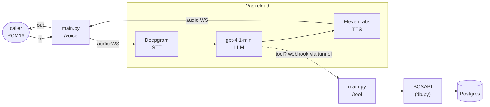

# app

The Python package for Riley. Four modules: the FastAPI bridge/webhook app that
connects a `voice_ws` caller to a Vapi call, the tool schemas + dispatcher, the
Postgres-backed card-ops layer the tools call, and a small Veris reporting shim.
The process topology, tunneling, and how to run a simulation live in the
[top-level README](../README.md); this doc is about the code.

| Module | Role |
|--------|------|
| `main.py` | The whole runtime. `WS /voice` creates one Vapi WebSocket call per connection (inline assistant: `agent_desc.txt` prompt, the five tools, PCM16 @ 24 kHz) and pumps audio both ways. `POST /tool` receives Vapi's tool-call webhooks and dispatches them. Also owns the lazy cloudflared quick tunnel. |
| `tools.py` | The five card-ops tool schemas in Vapi's `type=function` + `server.url` shape (`build_tools`), and `dispatch()`, which maps a tool name + args onto one `BCSAPI` method. |
| `reporting.py` | Veris integration shim. `report_tool_call` fire-and-forgets each tool call to the sandbox engine so it lands in the graded trace; a no-op outside a simulation. |
| `db.py` | The card-ops schema (pydantic models + enums), a psycopg2 `Database` wrapper, and `BCSAPI`, the validated facade the tools go through. See also [`db/README.md`](../db/README.md) for the data itself. |

`__init__.py` is empty — this is a plain namespace package, run as
`uvicorn app.main:app`.

## How one call flows through the package

1. A caller opens `WS /voice`. `main.py` ensures the tunnel is up, POSTs
   `api.vapi.ai/call` with the inline assistant config, connects to the
   `websocketCallUrl` Vapi returns, and starts two pump tasks.
2. Vapi's hosted orchestrator runs the conversation: Deepgram transcribes, the
   LLM (with `agent_desc.txt` as its system prompt) decides what to say and
   which tool to call, ElevenLabs speaks the reply back over the call WS.
3. A tool call is POSTed to `/tool` through the tunnel →
   `dispatch()` → `BCSAPI` (validation) → `Database` (SQL) → Postgres, and the
   JSON result goes back to Vapi synchronously.

## The five tools

Each `TOOL_FUNCTIONS` entry maps via `dispatch()` onto one `BCSAPI` method:

| Tool | `BCSAPI` method | Notes |
|------|-----------------|-------|
| `display_user_info` | `get_user_info` | read-only lookup |
| `display_card_info_by_last4` | `find_card_by_last4` | read-only; attaches any in-flight replacement |
| `change_card_status` | `update_card_status` | a cancelled card can't be changed |
| `request_card_replacement` | `request_card_replacement` | cancels the old card, issues a new one, records a `replacement` row |
| `update_card_replacement_status` | `update_card_replacement_status` | advances requested → mailed → delivered |

Business rules live in `BCSAPI`, not the tools: cancelled cards can't be
re-statused or replaced. A rejected call raises `ValueError` in the facade,
which `/tool` returns to Vapi as `{toolCallId, error}` so the LLM sees the
reason.

## Design notes worth knowing before you edit

- **Tools report themselves to the Veris engine.** Vapi dispatches tools as
  HTTP webhooks to `/tool`, so they never reach the actor transcript and the
  grader can't see them. `report_tool_call` (in `reporting.py`) fire-and-forgets
  an `agent_tool_call` event to `ENGINE_URL` — on success *and* on error — so
  completed actions land in the graded trace. It no-ops when `SIMULATION_ID` is
  unset, and runs the blocking POST in a worker thread so it never delays the
  synchronous webhook response.
- **The tunnel is lazy.** cloudflared is spawned on the *first* `/voice`
  connection, not at startup, so the app boots cleanly (and passes the
  entrypoint's TCP probe) even when the tunnel provider is unreachable — e.g.
  during scenario generation, when only prompt + tool metadata are needed.
- **The webhook is authoritative; the WS `tool-calls` event is not.** Vapi also
  mirrors tool calls as informational client messages on the audio WebSocket;
  the bridge logs those but only the HTTP `/tool` webhook dispatches.
- **`_extract_tool_call` supports two payload shapes.** Vapi's live webhook uses
  the OpenAI shape (`{id, function: {name, arguments}}`); older docs showed a
  flat `{id, name, arguments}`. Both are handled.
- **Endpointing is Vapi's, tuned to ~0.8 s.** Vapi's turn-commit runs in its
  hosted orchestrator and can't be replaced; `transcriptionEndpointingPlan`
  is what controls it, and its countdown starts once the transcript arrives
  (~0.25 s after speech stops), so 0.6 s on punctuated turns keeps total
  endpointing at or above the 0.8 s standard shared across the Riley
  transports. `waitSeconds` is only a floor on how soon reply audio may flow,
  never the limiter.
- **Interruption and denoising are tuned per Vapi's config review.**
  `stopSpeakingPlan` requires 2 confidently transcribed words to barge in
  ("stop" / "hold on" interrupt immediately), and background speech denoising
  — on by default in Vapi — is disabled for parity with the other Riley
  transports, where background noise is not tested.
- **Tool dispatch is `sync` inside an async handler.** psycopg2 is synchronous;
  tool calls are infrequent enough that briefly blocking the loop on a quick
  query is fine. Don't make `db.py` async without a reason.

## Configuration

Model and provider knobs are read from the environment in `main.py`
(`VAPI_API_KEY`, `VAPI_MODEL*`, `VAPI_VOICE*`, `VAPI_TRANSCRIBER*`,
`PUBLIC_BASE_URL`, `PORT`); `db.py` reads `DATABASE_URL`; `reporting.py` reads
`ENGINE_URL` and `SIMULATION_ID`. The full table with defaults is in the
[top-level README](../README.md#environment).
